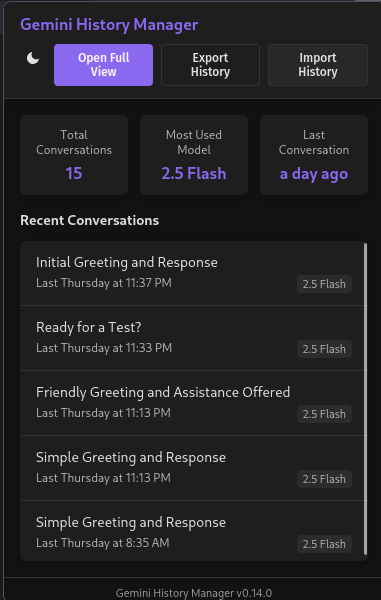
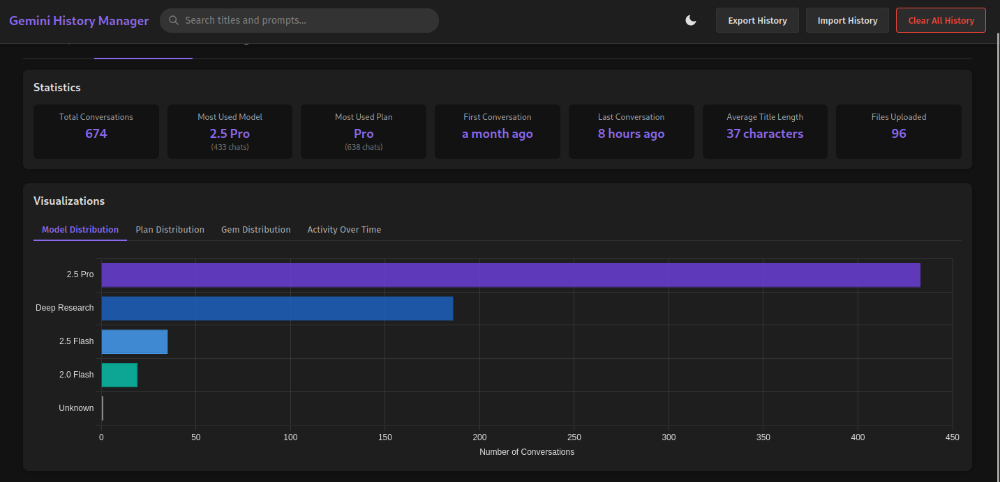

# ✨ Gemini History Manager ✨

<p>
  
  
</p>

Gemini History Manager is a browser extension designed to automatically track, manage, and help you visualize your Google Gemini chat history. It offers tools for organizing, searching, and deriving insights from your interactions with Gemini.

---

## 📸 Screenshots

### Browser Popup Interface


_Quick overview with recent conversations and key statistics_

### Full Dashboard - History View


_Comprehensive list view with search, filtering, and sorting capabilities_

### Dashboard - Visualizations


_Interactive charts showing model usage and activity over time_

---

## 🚀 Features

- **🤖 Automatic Chat Tracking**:
  - Captures chat URL, title, and an ISO 8601 UTC timestamp.
  - Identifies the Gemini model used (e.g., "2.5 Pro", "2.0 Flash", "Deep Research", "Veo 2").
  - **Custom Gem Detection**: Identifies chats occurring within a custom Gem environment, capturing the Gem's name and ID when available.
  - Records the initial prompt and a list of any attached filenames.
  - Attempts to extract the Google account name and email associated with the chat.
  - Prevents duplicate entries based on chat URL.
- **🚦 Status Indicator**:
  - Displays a non-intrusive status indicator (e.g., "Saving chat...", "Chat saved") on the Gemini page during tracking.
- **🖼️ Browser Action Popup (Vue-powered)**:
  - Provides a quick overview: total conversations, most frequently used model, and the time of the last conversation.
  - Lists recent conversations with direct links.
  - Includes buttons to open the full dashboard, export history, and import history.
  - Features a theme toggle (Light/Dark).
- **📊 Full Dashboard Page (Vue-powered)**:
  - **Comprehensive List View**: Displays all saved conversations.
    - Indicates if a conversation involved a custom Gem directly in the list (e.g., "Gem: <Gem Name>").
  - **Search & Filtering**:
    - Search by chat title and prompt content.
    - Filter by Gemini model.
    - Filter by date range (All Time, Today, This Week, This Month, Custom Range).
  - **Sorting**: Sort conversations by date (newest/oldest), title, or model.
  - **Detailed View**: Click on a conversation to view full details (title, date, model, account, prompt, attached files) in a modal.
    - Displays the name and ID (if available) of any custom Gem used in the conversation.
    - Provides a direct link to view the original Gem page if a Gem was involved.
  - **Data Statistics**:
    - Total conversations.
    - Most used model and its count.
    - Average title length.
    - Timestamps of the first and last conversations.
    - Total number of files uploaded across all chats.
  - **Visualizations (using Chart.js)**:
    - **Model Distribution**: Bar chart showing the usage frequency of different Gemini models.
    - **Activity Over Time**: Line chart illustrating the number of conversations over different periods.
  - **Data Management**:
    - **Export History**: Export all or filtered history as a JSON file.
    - **Import History**: Import history from a previously exported JSON file, merging new entries and avoiding duplicates.
    - **Clear All History**: Permanently delete all stored conversations.
  - **Theme Toggling**: Switch between Light and Dark themes.
  - **Toast Notifications**: Provides feedback for actions like saving, deleting, importing, or exporting data.

---

## 🔧 How it Works

The extension operates through several key components:

1.  **Content Script (`content-scripts/gemini-tracker.js`)**:
    - Injects into `https://gemini.google.com/*` pages.
    - Monitors user interactions, specifically clicks on the "Send" button when initiating a new chat.
    - Distinguishes between regular Gemini chats (on `gemini.google.com/app`) and interactions with custom Gems (on `gemini.google.com/gem`) to apply specific tracking logic.
    - Recognizes and handles URLs with the `/u/[n]/` multi-account structure for accurate tracking across multiple Google accounts.
    - Captures the current model, prompt text, and any attached filenames.
    - Utilizes `MutationObserver` to detect the newly created conversation item and its generated title in the sidebar.
    - Saves the complete chat entry (timestamp, URL, title, model, prompt, files, account info, and Gem details if applicable) to `browser.storage.local`.
    - Displays a status indicator for user feedback.
2.  **Background Script (`background.js`)**:
    - Updates the browser action badge with the total number of saved conversations.
    - Handles the browser action click to show the popup.
    - Responds to messages from other scripts, such as a request to open the full dashboard page.
3.  **Popup (`popup/main.js` and `popup/App.vue`)**:
    - A Vue.js application that retrieves history data from `browser.storage.local`.
    - Displays key statistics and a list of recent conversations.
    - Provides navigation to the full dashboard and data management actions (export/import).
4.  **Dashboard (`dashboard/main.js` and `dashboard/App.vue`)**:
    - A Vue.js application that loads all history data from `browser.storage.local`.
    - Offers a rich user interface for viewing, filtering, sorting, visualizing, and managing chat history.
    - Uses Day.js for date and time manipulations and Chart.js for data visualizations.
5.  **Shared Libraries (`lib/`)**:
    - **`utils.js` / `themeManager.js`**: Contains shared functions for logging, date formatting (using Day.js), and theme management (light/dark modes).

---

## 🧑‍💻 Development

Note: The primary development and testing workflow for this extension is centered around Mozilla Firefox, utilizing `web-ext` for streamlined development.

### Prerequisites

- Node.js (v18+ recommended)
- Package manager: pnpm, npm, or Yarn

---

### Setup

1.  **Clone the repository**:
    ```bash
    git clone https://github.com/InvictusNavarchus/gemini-history-manager.git
    cd gemini-history-manager
    ```
2.  **Install dependencies**:

    ```bash
    # Using pnpm
    pnpm install

    # Using npm
    npm install

    # Using Yarn
    yarn install
    ```

3.  **Build the project**:

    ```bash
    # Using pnpm
    pnpm run build

    # Using npm
    npm run build

    # Using Yarn
    yarn build
    ```

    This generates the installable extension in the `dist` directory.

---

## 📥 Installation

> [!IMPORTANT]
> **Web Store Availability**: This extension is not yet available on the Chrome Web Store (as Chrome is not currently supported) or the Mozilla Firefox Add-ons portal. Links will be provided here if and when it is published to any store.

### Manual Installation (Developer Mode)

#### For Google Chrome/Chromium-based browsers:

Google Chrome is not officially supported at this time. We plan to work on Chrome compatibility in the future.

#### For Mozilla Firefox:

1.  Clone this repository or download and extract the ZIP file (as above).
2.  Build the project (as above).
3.  Open Firefox and navigate to `about:debugging#/runtime/this-firefox`.
4.  Click on **Load Temporary Add-on...**.
5.  Select the `manifest.json` file located inside the `dist` directory.

The extension icon should now appear in your browser's toolbar.

---

## 💡 Usage

### Tracking Chats

- Simply use Google Gemini as you normally would. The extension automatically detects when a new chat is initiated.
- Once the chat is established and Gemini generates a title for it in the sidebar, the extension saves its details (URL, title, timestamp, model, initial prompt, and any files).
- A small status indicator in the bottom-right corner of the Gemini page will provide feedback on the tracking process.

### Popup Interface

- Click the Gemini History Manager icon in your browser toolbar.
- The popup displays:
  - Total conversations, most used model, and the time of the last conversation.
  - A list of your most recent conversations (clickable to open in a new tab).
  - Buttons for:
    - Opening the full dashboard view.
    - Exporting your chat history.
    - Importing chat history from a JSON file.
    - Toggling between light and dark themes.

### Dashboard Interface

- Access the dashboard via the "Open Full View" button in the popup.

    <details>
    <summary><strong>Dashboard Tabs & Functionality</strong></summary>

  - **📈 History Tab**:
    - **View History**: Scroll through the list of all your conversations.
    - **Filter & Sort**: Use the controls in the sidebar and header to refine and reorder your history by search term, model, date range, and sort criteria.
    - **Details**: Click any conversation to see its full details in a modal.
  - **📊 Visualization Tab**:
    - **Statistics Overview**: View cards with key metrics about your chat history.
    - **Charts**:
      - **Model Distribution**: See which Gemini models you use most frequently.
      - **Activity Over Time**: Track your conversation frequency over time, with options to view combined activity or activity per model.
  - **⚙️ Data Management (Header Buttons)**:
    - **Export History**: Export all or currently filtered conversations to a JSON file.
    - **Import History**: Select a previously exported JSON file to merge its contents with your current history (duplicates are avoided).
    - **Clear All History**: Permanently delete all stored chat history (a confirmation will be required).
    - **Theme Toggle**: Switch between light and dark modes for the dashboard.
    </details>

---

## 🔐 Permissions Required

- **`storage`**: To save and retrieve your Gemini chat history locally using `browser.storage.local`.
- **`unlimitedStorage`**: To allow for a potentially large amount of chat history to be stored.

---

## 🛠️ Technology Stack

<details>
<summary><strong>View Full Stack</strong></summary>

- **Core**: JavaScript (ES6+)
- **UI Framework**: Vue.js (v3)
- **Browser API**: WebExtensions API
- **Styling**: HTML5 & CSS3
- **Build Tool**: Vite
- **Date/Time**: Day.js (with plugins: `utc`, `relativeTime`, `isToday`, `localizedFormat`, `calendar`, `timezone`, `isSameOrBefore`)
- **Charts**: Chart.js (v4)

</details>

---

## ⚠️ Limitations

While Gemini History Manager aims to be a comprehensive tool for tracking your Gemini chats, it's important to understand its current limitations:

### Data Storage

- **Local Storage Reliance**: The extension uses `browser.storage.local`. While `unlimitedStorage` permission helps, browser-specific quotas or policies could still impose limits. Performance may degrade with large datasets (many thousands of conversations).
- **No Cloud Sync/Backup**: All data is stored locally within the browser instance where the extension is installed. There is no automatic cloud synchronization or backup feature. If you clear your browser data or use a different browser profile/computer, the history will not be available unless manually exported and imported.
- **Single Browser Instance**: Data is tied to the specific browser and profile it was saved on.

### Data Capture

- **DOM Dependent & Fragile**: Chat detection and data extraction heavily rely on the current HTML structure of the Gemini website. Changes made by Google to the Gemini interface can break the extension's tracking capabilities, requiring updates to the extension.
- **Initial Prompt Focus**: The extension primarily captures the _initial_ prompt of a conversation. Subsequent edits to the prompt, or the nuances of multi-turn interactions within a single chat session, may not be fully captured.
- **No Inline Image Content**: Only the _filenames_ of uploaded images are recorded, not the image content itself.

### Feature Set

- **Manual Data Management**: Backup and transfer of history rely on manual export and import of JSON files. No automatic backup or cloud synchronization features are currently implemented.
- **Search Functionality**:
  - **Current Capabilities (Basic Search)**: The existing search feature is primarily a case-insensitive filter targeting chat titles and the initial prompt text. It does not support advanced search operators (e.g., AND, OR, NOT), regular expressions, or exact phrase matching. As the extension focuses on capturing the initial prompt, full-text search across entire multi-turn conversation content is not available.
  - **Potential Future Enhancements**:
    - Implementing full-text search across all captured conversational data (if the scope of data capture were expanded beyond initial prompts).
    - Adding support for advanced search operators (AND, OR, NOT) and exact phrase matching.
    - Providing user options for case-sensitive and case-insensitive searching.
    - Integrating metadata filters (e.g., date ranges, models used) more directly into the search query syntax.
- **Pre-defined Visualizations**: The dashboard offers a set of pre-defined charts and statistics. User-customizable reporting or visualization options are not currently supported.
- **No Collaborative Features**: The extension is designed for individual use. There are no features for sharing history or collaborating with other users.
- **Gemini Specific**: Designed exclusively for Google Gemini. It does not support other LLM platforms yet (e.g., ChatGPT, Claude).

### Performance

- **Large Dataset Impact**: With large datasets of stored conversations, users might experience slowdowns in the dashboard when loading, filtering, or searching, due to lack of indexing and efficient searching algorithm.
- **DOM Observation Overhead**: The continuous observation of the Gemini page for new chats can have a minor performance footprint.

### Platform & Browser Compatibility

- **Firefox Prioritized**: Primary development and testing are done on Mozilla Firefox.
- **Can't run on Chrome yet:** Google Chrome has a slightly different Manifest structure and Web Extension API.
- **No Mobile Support**: The extension is designed for desktop browsers and is unlikely to work on mobile browsers.

### Security & Privacy

- **Local Data Responsibility**: Your chat history is stored locally on your computer. This is beneficial for privacy as your data is not sent to the extension developer. However, you are responsible for securing your local machine and browser environment.

### Maintenance

- **Website Dependency**: The extension's core functionality is tightly coupled to the Gemini website's structure. Changes by Google can necessitate frequent updates to the extension to maintain functionality. This reliance means there's a potential for periods where the extension may not work as expected until it's updated.

---

## 📄 License

This project is licensed under the **GPL v3 License**. See the `LICENSE` file for more details.
